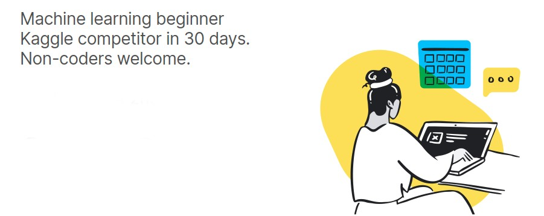
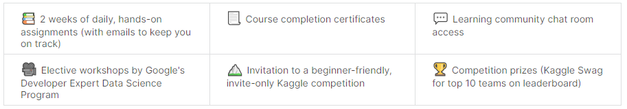

<h1>#30daysofML </h1> 

<h2>Kaggle’s 30 Days of ML Daily Assignments </h2>

<h1></h1>
 

<h3>💫 <u><b>Day1 :</u></b></h3>
<h4>-Joined 30 Days of ML Discord Community.</h4>
 

<h3>💫 <u><b>Day2 :</u></b></h3>
<h4>-Completd the ' Hello, Python! ' exercise from Lesson 1 of the <a href="https://www.kaggle.com/learn/python"> <b> Python course </b></a>.</h4>
 

<h3>💫 <u><b>Day3 :</u></b></h3>
<h4>-Completed the ' Functions and Getting Help  ' exercise from Lesson 2 of the <a href="https://www.kaggle.com/learn/python"> <b> Python course </b></a>.</h4>
 

<h3>💫 <u><b>Day4 :</u></b></h3>
<h4>-Completed the ' Booleans and Conditionals  ' exercise from Lesson 3 of the <a href="https://www.kaggle.com/learn/python"> <b> Python course </b></a>.</h4>
 

<h3>💫 <u><b>Day5 :</u></b></h3>
<h4>-Completed the ' Lists ' exercise from Lesson 4 of the <a href="https://www.kaggle.com/learn/python"> <b> Python course </b></a>.</h4>
<h4>-Completed the ' Loops and List Comprehensions ' exercise from Lesson 5 of the <a href="https://www.kaggle.com/learn/python"> <b> Python course </b></a>.</h4>
 

<h3>💫 <u><b>Day6 :</u></b></h3>
<h4>-Completed the ' Strings and Dictionaries ' exercise from Lesson 6 of the <a href="https://www.kaggle.com/learn/python"> <b> Python course </b></a>.</h4> 
 

<h3>💫 <u><b>Day7 :</u></b></h3>
 

<h1></h1>
<h2>Program Highlights </h2>

<h1></h1>
